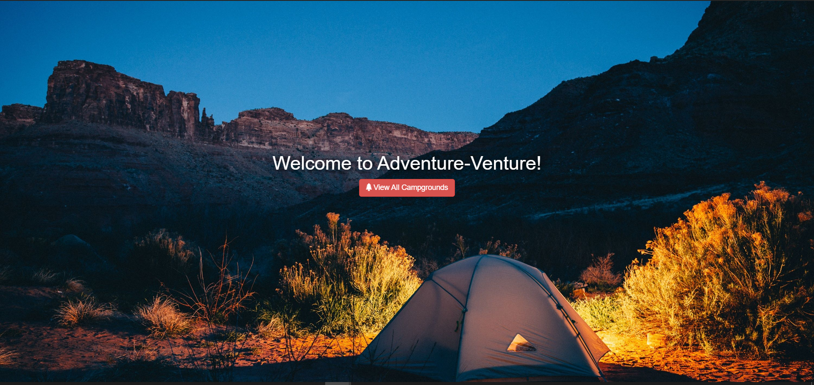

# Adventure-Venture

Adventure-Venture is fully functional NodeJs web app. This is a camping ground website.

With Adventure-Venture, one can create and view data related to campsites you know, including a picture of the campsite.

## Getting Started

### Prerequisites

1. **Node.js** for running server-side JavaScript. You can find instructions on how to download and install Node.js for your computer [here](https://nodejs.org/en/download/)

2. **MongoDB** (Community Edition preferrably) to store data. Instructions on downloading and installing MongoDB on your computer can be found [here](https://docs.mongodb.com/manual/installation/)

### Installing

Once you have Node.js and MongoDB installed on your computer,

1. [Download](https://github.com/smit-sms/Adventure-Venture/archive/master.zip) the project or Clone it to your computer by running `git clone https://github.com/smit-sms/Adventure-Venture.git` on your Git terminal.
2. In the directory of the folder `Adventure-Venture` containing the files of the repository and run `npm install` in terminal.
3. Once installation is complete, run `npm start` on the same terminal.
4. Open your web browser and visit the address `localhost:3000` and voila!
5. Sign up to use the awesome features of the app!

## Built With

- [Node.js](https://nodejs.org) - Node.js® is a JavaScript runtime built on Chrome's V8 JavaScript engine.
- [Express](https://expressjs.com/) - Fast, unopinionated, minimalist web framework for Node.js
- [MongoDB](https://www.mongodb.com/) - The database for modern applications
- [Mongoose](https://mongoosejs.com/) - Elegant MongoDB object modeling for Node.js
- [EJS](https://ejs.co/) - Embedded JavaScript templating
- [Passport](http://www.passportjs.org/) - Simple, unobtrusive authentication for Node.js
- [Bootstrap 4](https://getbootstrap.com/) - The most popular front-end framework for developing responsive, mobile-first websites.
